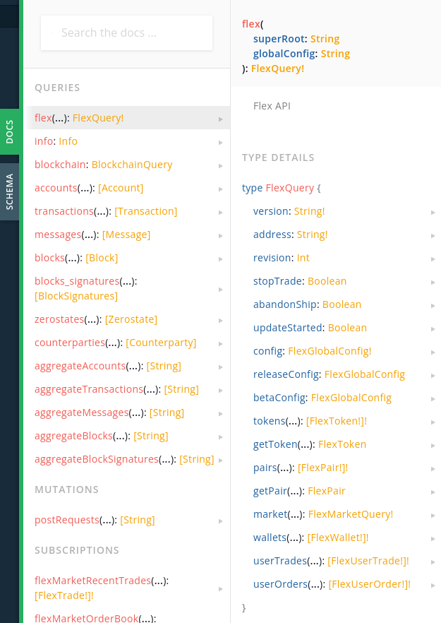

# Flex API

[Flex DEX](https://flexdex.fi/) is a fast decentralized exchange with a limit order book built on Everscale.

[Flex API](https://docs.flexdex.fi/technical-description/flex-sdk-api) enables one to read data and subscribe to data changes on Flex DEX.

<figure><figcaption></figcaption></figure>

Get Flex DApp here: [https://flexdex.fi/](https://flexdex.fi/)

Review full Flex API specifications here: [https://docs.flexdex.fi/technical-description/flex-sdk-api](https://docs.flexdex.fi/technical-description/flex-sdk-api)
