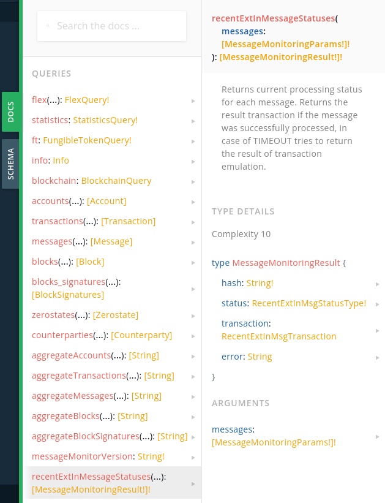
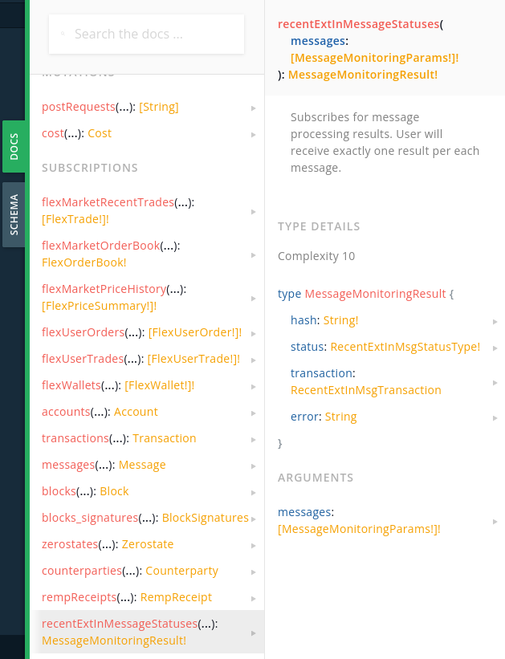

# Message Monitor API

`Message Monitor` API is optimized for monitoring batches of messages.

It can be used in 2 ways:

* subscribe for the statuses of a batch of messages via websocket
* query the status of a batch of messages with 1 query

<div>

<figure><figcaption></figcaption></figure>

 

<figure><figcaption></figcaption></figure>

</div>

Specification:

```graphql
subscription {
    # Subscribes for message processing results.
    # User will have received exactly one result per each message.
    recentExtInMessageStatuses(messages: [MessageMonitoringParams!]): MessageMonitoringResult
}

query {
    ""
    Returns message processing results for messages, that were sent within the past hour
    and are cached in the transaction pool.
		If you sent your message earlier than 1 hour ago, and the query returned TIMEOUT,  
    use message hash to retrieve message data and status.
    ""
    recentExtInMessageStatuses(messages: [MessageMonitoringParams!]): [MessageMonitoringResult!]
}

type SendMessageParams {
    "" Message BOC in Base64""
    message: String!
}

type MessageMonitoringParams {
    "" TVM hash of the message BOC ""
    hash: String

		"" Destination address of the external inbound message ""
    address: String

		"" Message BOC in base64, needed to resolve an error in case of failed message processing ""
    boc: String

    "" Wait for message finalization until wait_until shard block time in UNIX time""
    wait_until: Float!
}

type MessageMonitoringResult {
    "" TVM hash of the message BOC ""
    hash: String!
		"" Shows message status, if it was or was not finalized until wait_until block time""
		status: MessageMonitoringStatus!

    ""
    Contains transaction.
    In case of FINALIZED the transaction is extracted from the block.
    In case of TIMEOUT the transaction is emulated using last known account state.
		Can be Null in case of emulation on non-existing account.
    ""
    transaction: Transaction

    ""
    Contains an error message when status is TIMEOUT. Message boc is needed to resolve error message.
    ""
    error: String
}

enum MessageMonitoringStatus {
    ""
    Returned when the messages is processed before wait_until block time
    ""
    FINALIZED,
    ""
    Returned when the message was not processed until wait_until block time
    ""
    TIMEOUT
		""
		Reserved for future statuses. Is never returned.
		""
		RESERVED
}
```

Explore:

* [GraphQL samples](../../samples/graphql-samples/message-processing-and-monitoring.md)
* [SDK Guide](https://docs.everos.dev/ever-sdk/guides/work\_with\_contracts/monitor-messages)
