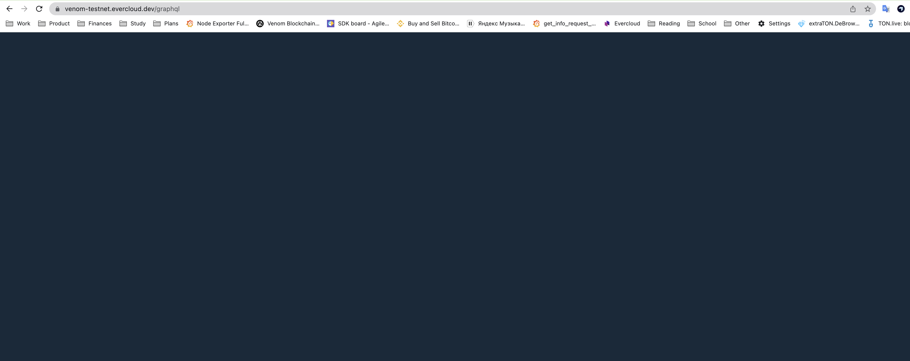

# Quick Start

Let's start with observing API in sandbox playground.

Learn how to read API documentation.

Then move to making an api request with curl.

And integrate it with ever-sdk.&#x20;

## Playground

Go to GraphQL playground [https://devnet-sandbox.evercloud.dev/graphql](https://devnet-sandbox.evercloud.dev/graphql)

Insert this query in the left part.&#x20;

```graphql
query{
blockchain{
    account(address:"-1:3333333333333333333333333333333333333333333333333333333333333333"){
      info{
        balance(format:DEC)
        address
      }
    }
  }
}
```

Now click play button and you will see the result:

<figure><figcaption><p>В</p></figcaption></figure>

## Documentation

Click on the button "schema" on the right. You will see the API documentation with all available fields. Try to make your own query now.

<figure><figcaption></figcaption></figure>

## Request with curl

```
curl --location --request POST 'https://devnet-sandbox.evercloud.dev/graphql' \
--header 'Content-Type: application/json' \
--data-raw '{"query":"query($address: String!){\n  blockchain{\n    account(address:$address){\n      info{\n        balance(format:DEC)\n      }\n    }\n  }\n}","variables":{"address":"0:3333333333333333333333333333333333333333333333333333333333333333"}}'
```

## Request with SDK (JavaScript)

```javascript
const {TonClient} = require("@eversdk/core");
const {libNode} = require("@eversdk/lib-node");

TonClient.useBinaryLibrary(libNode)

const client = new TonClient({
    network: {
        endpoints: [
            "https://devnet-sandbox.evercloud.dev/graphql"
        ],
    },
});

(async () => {
    try {
        // Get account balance. 
        const query = `
            query {
              blockchain {
                account(
                  address: "${address}"
                ) {
                   info {
                    balance(format: DEC)
                  }
                }
              }
            }`
        const {result}  = await client.net.query({query})
        console.log(`The account balance is ${result.data.blockchain.account.info.balance}`);
        client.close();
    }
    catch (error) {
        console.error(error);
    }
}
)()
```
